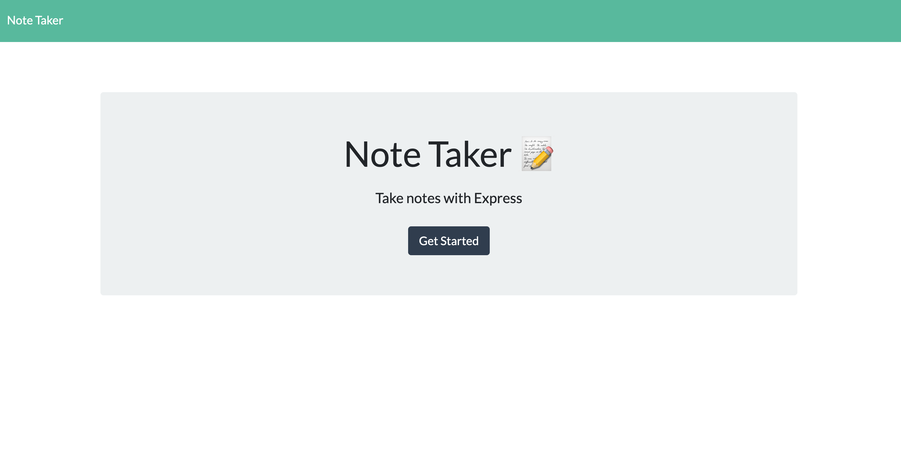
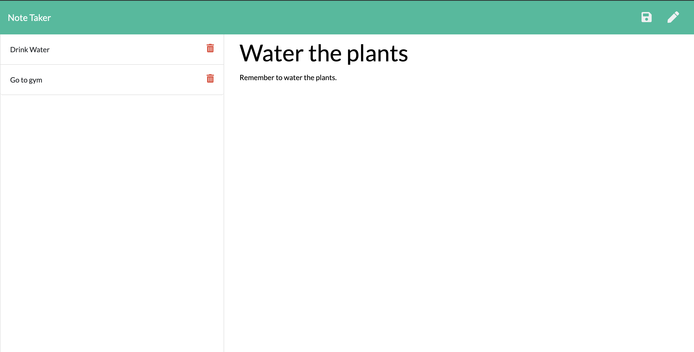

# Note Taker

  ## Table of Contents
  1. [Description](#description "Description")
  2. [Installation](#installation "Installation")
  3. [Usage](#usage "Usage")
  4. [License](#license "License")
  5. [Contribution](#contribution "Contributing")
  6. [Tests](#tests "Tests")
  7. [Questions](#questions "Questions")

  ## Description
  

  An app that allows user to create and save notes. Notes have a title and a body/description. Notes get saved in a JSON file, from which they are also rendered, using a back-end app powered by Express.js

  ## Installation
  N/A

  ## Usage
  First the user gets to the index page, where they can click on "GET STARTED". Then they are taken to the notes page, where previous notes get displayed and users can enter new notes. They have the option to save new notes and they can also delete previous notes.

  

  

  Here's a link to the deployed app in Heroku: [Note Taker](https://cryptic-shelf-27313.herokuapp.com/)

  ## License
  For more information on the license for this project, please click on the following link:
  [License](https://opensource.org/licenses/Apache-2.0)

  ## Contribution
  This project was a homework for the UM Coding Bootcamp. The front-end part of the code was provided with the homework. The back-end portion was made by Luis Rujana.

  ## Tests
  N/A

  ## Questions
  If you have any questions regarding this application, please contact me at:  
  [GitHub Page](https://github.com/lmrujana)  
  Email: lmrujanass@gmail.com
